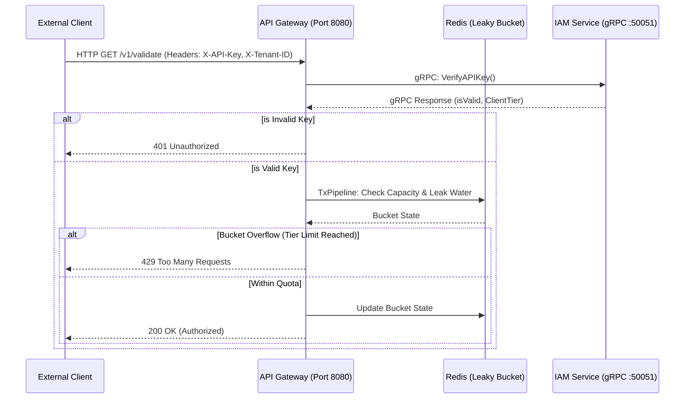

# 🛡️ Enterprise API Gateway & IAM Microservice

A highly concurrent, multi tenant API Gateway and Identity Access Management (IAM) microservice designed for SaaS platforms. Built to secure core application endpoints, enforce tenant specific request quotas, and ensure robust internal service to service communication.

## 📖 Overview

In a multi tenant SaaS environment, protecting backend resources from abuse while enforcing subscription tier limits is critical. This architecture splits the routing and authentication concerns into two distinct components:
1. An **API Gateway** acting as the public facing ingress and rate-limiting firewall.
2. An **IAM Microservice** operating in an isolated internal network, acting as the single source of truth for cryptographic token validation and tenant identity.

## 🏗️ System Architecture



## ✨ Core Features

* **Ultra-Low Latency Internal RPC:** Utilizes **gRPC** and **Protocol Buffers** for strictly-typed, binary-serialized communication between the Gateway and internal IAM service.
* **Distributed Rate Limiting:** Implements the **Leaky Bucket** algorithm utilizing **Redis Transactions (Pipelining)** to atomically enforce SaaS tier API limits across distributed gateway instances.
* **Cryptographic Payload Security:** Pre-configured architecture for generating and validating **RSA Asymmetric Digital Signatures** for secure webhook and session data transmission.
* **Infrastructure as Code (IaC):** Fully containerized dependency stack using Docker for deterministic local development and deployment.

## 🛠️ Technology Stack

* **Language:** Go (Golang)
* **RPC Framework:** gRPC & Protocol Buffers (protobuf)
* **In-Memory Store:** Redis v9
* **Infrastructure:** Docker & Docker Compose

## 🚀 Getting Started

### 1. Prerequisites
* Go 1.21+ installed
* Docker Desktop running
* Protocol Buffers Compiler (`protoc`) installed

### 2. Infrastructure Setup
Spin up the required Redis caching layer using Docker Compose:
```bash
docker compose up -d
```

### 3. Compile Protocol Buffers
Generate the Go gRPC client and server code from the `.proto` contract:
```bash
protoc --go_out=. --go_opt=paths=source_relative \
       --go-grpc_out=. --go-grpc_opt=paths=source_relative \
       proto/iam.proto
```

### 4. Run the Microservices
The system requires both services to run concurrently. Open two separate terminal sessions:

**Terminal 1: Start the IAM Microservice**
```bash
go run iam-service/main.go
```

**Terminal 2: Start the API Gateway**
```bash
go run gateway/main.go
```

## 🧪 API Usage & Testing

The gateway exposes an HTTP endpoint that validates the tenant identity and enforces rate limits.

**Successful Request (200 OK):**
```bash
curl -i -H "X-API-Key: engigrow_secret_prod_key" \
        -H "X-Tenant-ID: tenant_123" \
        http://localhost:8080/v1/validate
```
*Response:*
```json
{
    "status": "authorized",
    "tier": "premium"
}
```

**Rate Limited Request (429 Too Many Requests):**
If a tenant exceeds their assigned burst capacity (e.g., executing the above curl command in rapid succession), the gateway's Leaky Bucket algorithm will intercept the request before forwarding it to the internal network.

*Response:*
```json
{
    "reason": "SaaS API rate quota exceeded. Please upgrade your tier.",
    "status": "rejected"
}
```

## 📂 Directory Structure

```text
.
├── docker-compose.yml       # Infrastructure dependencies
├── go.mod                   # Go module dependencies
├── proto/
│   ├── iam.proto            # gRPC service definitions
│   ├── iam.pb.go            # Generated protobuf data structures
│   └── iam_grpc.pb.go       # Generated gRPC client/server interfaces
├── gateway/
│   └── main.go              # Edge HTTP gateway & Leaky Bucket rate limiter
└── iam-service/
    └── main.go              # Internal tenant authorization and cryptography service
```